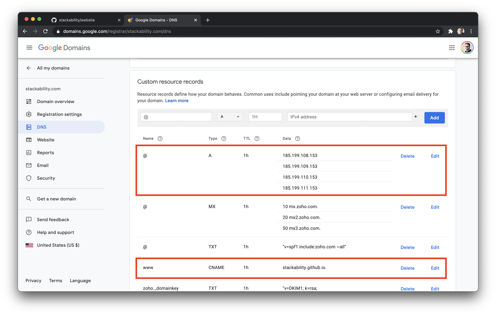

# The Stackability Website

* Built with [markdown] and [hugo].
* Uses <https://github.com/StaticMania/portio-hugo> portio theme.

## Ermahgerd On-boarding

### Hugo


It took forever to get `hugo` to just ... show a site.

The "[quick start]" on gohugo.io walks through a golden path that isn't realistic
for other builds.  Because it glosses over what files need to be copied from the
theme to your site.

Here's what I did in one folder above website (the name of this repo), so start
in the same place.

```shell
$ echo $PWD
/Users/tbird/code/stackability
```

Then I did all these [shenanigans] to turn what was in the repo into something
that **GitHub Pages** would build and show for our site.

```shell
# Backed up the config I had from before
cp website/config.toml website/config.toml.bak 
# Try to "use the force" and put in existing "website" folder
hugo new site website --force
# "The force is not strong with hugo", so I remove all the things
rm -rf website/content/ website/docs/ website/resources/ website/themes/ website/archetypes/ website/config.toml
# Now I can do a "new" website
hugo new site website --force
# The rest of the commands below need to be in the "website" folder
cd website/
# We're trying out the StaticMania/portio-hugo theme in this iteration
git submodule add git@github.com:StaticMania/portio-hugo.git themes/portio
# Start your git submodule engine
git submodule init
# Actually get the code from the submodule
git submodule update
# Get rid of the generated config
rm -rf website/config.toml
# Restore the previous config
cp website/config.toml.bak website/config.toml
# This is where we remove generated stuff to get ready for demo site files
rm -rf content/ docs/ resources/ archetypes/
# copy files from the "portio" theme to our "website" folder
cp -rp themes/portio/exampleSite/. . 
# ------------
# I grabbed stuff from the "portio" exampleSite/config.tml file
# And added it to our `config.toml`
# ----------
# My test was always to get no errors from `hugo server -D`
# Finally it ran.. \o/
hugo server -D # -D includes drafts, `hugo' builds to `publishDir`, 
               # and `hugo server` builds and hosts a localhost site at
               # http://localhost:1313/
               # use `hugo server --help` for all the helps
```

### GitHub Pages

That's the Hugo malarky... Now let's trash talk our free host, GitHub Pages.

These files are needed, from the root path of this repo:

```shell
config.toml
docs/CNAME
index.html
.nojekyll
```

#### `config.toml`

* Change theme to `theme = "portio"`
* Copy the theme specific configs from [`themes/portio/config.toml`] to `config.toml`
* Add the `publishDir = "docs"` in our `config.toml` to match GitHub Pages convention

#### `docs/CNAME`

Maps the custom domain to this repo, looks like this:

```
www.stackability.com
```

#### `index.html`

Can be an empty file, otherwise opening a custom domain shows a GitHub 404 page.

The site is served statically from the `docs` folder.

#### `.nojekyll`

Turns off the default action steps to build and display a Jekyll site.


### DNS

[Custom domains] require the following to be setup with DNS.

* An `A` record with 4 IP values
    * 185.199.108.153
    * 185.199.109.153
    * 185.199.110.153
    * 185.199.111.153
* A `CNAME` record pointing to `<organization>.github.io`, as in: (`stackability.github.io`)



[markdown]:                    https://daringfireball.net/projects/markdown/
[hugo]:                        https://gohugo.io/
[shenanigans]:                 https://www.youtube.com/watch?v=xdXo8uJ9NSk
[quick start]:                 https://gohugo.io/getting-started/quick-start/
[Custom domains]:              https://docs.github.com/en/github/working-with-github-pages/managing-a-custom-domain-for-your-github-pages-site

[`themes/portio/config.toml`]: themes/portio/exampleSite/config.toml
[below]: #`config.toml`
